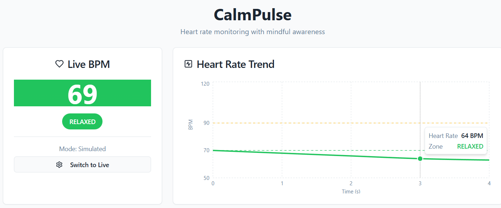
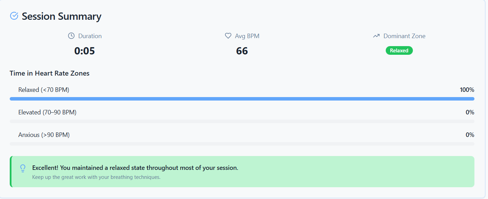

# CalmPulse

Real-time ECG-based biofeedback app. I built this as a capstone project for EN.585.795 Projects in Medical Sensors and Devices at Johns Hopkins University (Summer 2025).

An Arduino reads ECG signals from a 3-lead electrode setup, detects R-peaks to calculate BPM, and sends readings over serial to a Node.js backend. The backend pushes data to a React frontend over WebSocket, which displays live BPM, classifies your heart rate zone, and runs a breathing guide that adapts its pacing based on your current state.

This is a prototype. It ran locally on my machine with physical hardware during the course. The Arduino hardware no longer exists.

---

## Screenshots





---

## Architecture

```
3-lead ECG electrodes (right arm, left arm, right leg)
  -> Instrumentation amplifier + voltage divider -> analog pins A0/A1
    -> Arduino UNO R3 (QRS detection, BPM calculation, LED output on pins 9/10/11)
      -> Serial USB (COM3, 9600 baud)
        -> Node.js + Express + Socket.io backend (port 5000)
          -> WebSocket
            -> React frontend (Vite, port 5173)
```

The backend (`backend/arduinoServer.js`) opens the serial connection, listens for `BPM:<value>` lines from the Arduino, and broadcasts them to connected browser clients via Socket.io. The frontend connects on startup and updates in real time.

There is also a simulated mode where the Arduino sends synthetic BPM values (55 to 198 BPM, with smooth transitions between zones) so the full UI can run without hardware.

---

## Features

- **Live BPM display** updated in real time from Arduino serial output
- **Heart rate zones** with distinct color states:
  - Relaxed: 70 BPM and below
  - Elevated: 71 to 90 BPM
  - Anxious: above 90 BPM
- **LED hardware indicators** where the Arduino drives red, yellow, and green LEDs (pins 9, 10, 11) to show the current zone
- **Heart rate chart** showing the last 30 readings as a live line chart (Recharts)
- **Breathing guide** based on the 4-7-8 breathing method, with timing that adapts to your zone. The extended exhale in the anxious zone is intentional: longer exhales activate the parasympathetic nervous system via the Hering-Breuer reflex, which counteracts the sympathetic arousal driving the elevated heart rate.
  - Anxious: 4s inhale / 6s exhale
  - Elevated: 4s inhale / 4s exhale
  - Relaxed: 3s inhale / 3s exhale
- **Session control** to start and stop sessions, with each session recording duration, average BPM, and time spent in each zone
- **Session history** showing past sessions in the UI (not persisted across page reloads)

---

## Tech Stack

**Frontend**
- React 18, TypeScript, Vite
- Tailwind CSS, shadcn/ui (Radix UI primitives)
- Recharts (heart rate chart)
- Socket.io client

**Backend**
- Node.js, Express
- Socket.io server
- serialport + @serialport/parser-readline

**Hardware**
- ELEGOO UNO R3 (Arduino-compatible)
- 3-lead ECG configuration: right arm, left arm, right leg electrodes
- TRRS connector inputs into an instrumentation amplifier, then a voltage divider, then analog pins A0 and A1
- Red/yellow/green LEDs on output pins 9, 10, 11 for zone indication
- QRS detection on the Arduino using a derivative-based approach, with BPM calculated from the interval between detected R-peaks

---

## Running Locally

You need Node.js installed. The frontend and backend run as separate processes.

**1. Install frontend dependencies**

```bash
npm install
```

**2. Install backend dependencies**

```bash
cd backend
npm install
```

**3. Start the backend**

```bash
node arduinoServer.js
```

The server runs on `http://localhost:5000`. Without hardware, use simulated mode and toggle it from the UI after launch.

**4. Start the frontend**

```bash
# from the repo root
npm run dev
```

Open `http://localhost:5173`.

---

## Hardware Setup (if you have it)


- ELEGOO UNO R3 connected via USB
- 3-lead electrode placement: right arm, left arm, right leg
- TRRS connector carries electrode signals into the instrumentation amplifier; output connects to analog pins A0 and A1
- LEDs on pins 9 (red/anxious), 10 (yellow/elevated), 11 (green/relaxed) with equal resistance
- 3.3V powers the LED circuit; 5V powers the ECG circuit; two separate grounds
- The backend defaults to COM3 at 9600 baud. Change the `path` in `backend/arduinoServer.js` to match your port (e.g., `/dev/tty.usbmodem14101` on Mac/Linux)

Expected Arduino serial output format:

```
BPM:72
BPM:74
BPM:71
```

---

## Results

Simulation mode worked as intended. LEDs, breathing guide, and session history all responded correctly as BPM transitioned from 198 down to 55 through the simulated stress-to-calm arc.

Live ECG hardware integration worked but had accuracy issues. The QRS detection algorithm used a derivative-based approach with no smoothing or moving average, which produced a lot of false-positive peaks and pushed readings higher than actual. During a live demo I read around 147 BPM while presenting and a seated observer read around 125 BPM. The relative difference makes sense given the context, but the absolute values were likely overcounted because of the peak detection method.

---

## Known Limitations

- **COM port is hardcoded.** Line 26 of `arduinoServer.js` has `path: 'COM3'`. Change it before running with hardware.
- **QRS detection is noisy.** The derivative-based approach with no smoothing generates false peaks. Pan-Tompkins with adaptive thresholds would be a meaningful improvement.
- **Zone thresholds are fixed.** The 70/90 BPM cutoffs do not account for individual variation in resting heart rate or fitness level.
- **The breathing guide skips the hold phase.** The full 4-7-8 method is inhale 4s, hold 7s, exhale 8s. This implementation only does inhale and exhale.
- **Session history is in-memory.** A page refresh clears it.
- **Hardware no longer available.** The physical device from the course does not exist anymore, so the live ECG path has not been tested since project completion.

---

## If I Were to Continue This

- **Pan-Tompkins QRS detection.** Replacing the derivative-based algorithm with Pan and Tompkins' method (adaptive thresholds plus bandpass filtering) would cut down on false peaks significantly and make BPM reliable under mild movement.
- **Personalized zone calibration.** A short onboarding test to set individual thresholds instead of fixed 70/85 BPM cutoffs. Resting heart rate varies enough across people that hardcoded values limit accuracy for anyone outside the average range.
- **Five-zone model.** Aligning with standard exercise physiology zones based on HRmax percentage would give more granular feedback and make the system more clinically useful.
- **HRV analysis.** Short-term HRV metrics like RMSSD and pNN50 alongside BPM would add a second dimension to stress assessment that heart rate alone does not capture.
- **Dry electrodes.** The wet electrode setup was the main usability bottleneck during testing. Dry electrodes would make the hardware practical outside a lab setting.

---

## Context

Capstone project for EN.585.795 Projects in Medical Sensors and Devices (JHU, Summer 2025). The assignment was to design, build, and document a functional biomedical instrumentation system end-to-end, from hardware through software.

The frontend was built with React, TypeScript, Vite, and shadcn/ui. The backend and Arduino communication layer were written from scratch.
